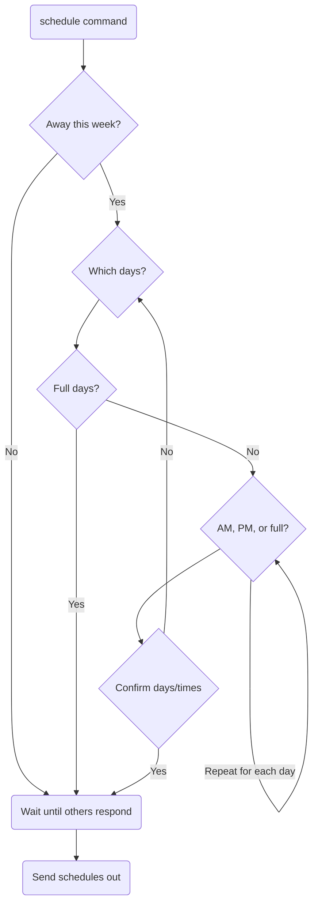

# 🐔 chickenbot

_Group task scheduling and reminders using Google Sheets and Twilio_

This software supports a small cohort of neighbors who share responsibility caring for a flock of chickens. It is somewhat flexible, but it does make some assumptions. There must be at least two people involved, tasks can't be more frequent than once per day, and the designated backup person is assumed to understand that they're responsible for making sure that tasks with an uncertain status are actually completed. An instance of the bot is running at [chickenbot.phiffer.org](https://chickenbot.phiffer.org/).

## Google Sheet

1. Make a new Google Sheet. (You can also make a copy of [this template](https://docs.google.com/spreadsheets/d/19DqJlX8DysBDObseu9c4sgy1vVTdOokGKfbkOAr77Q0/edit).)
2. Setup 4 sheets: Upcoming, Archive, Tasks, People.
3. The Upcoming and Archive sheets should each have columns: date, time, task, person, status.
4. The Tasks sheet should have columns: name, question, frequency, time.
5. The People sheet should have columns: name, phone, call, status, away.

Date and time columns need to be formatted like "6/21" and "7:16 PM" for the matching logic to work.

## Add tasks

The list of tasks get assigned to all the active people involved for a given week.

-   **name:** is how the task appears in the schedule
-   **question:** gets sent in the reminder text message, i.e., `Hi [person], [question]`
-   **frequency:** how often the task happens (`1` = every day, `7` = every week)
-   **time:** when the reminder gets sent (e.g., `8:00 AM` or `sunset` to schedule 10 minutes after when the sun sets)

Example morning task:

-   name: Open the door
-   question: did you open the chickens’ door? Check the water? Check the food?
-   frequency: 1
-   time: 8:00 AM

Example evening task:

-   name: Close the door
-   question: did you close the chickens’ door?
-   frequency: 1
-   time: sunset

## Add people

Add the names and phone numbers for people who will be caring for the chickens.

-   **name:** the person's name
-   **phone:** the person's phone number, formatting is flexible (e.g., `518-555-1212`)
-   **call:** whether to call instead of text (set to `yes` to override the default, to not call)
-   **status:** assign `active` to include a person in the rotation for a given week (other possible values: `backup`, `inactive`, or `vacation` which is like inactive but includes someone in task scheduling)
-   **away:** a list of days the person is away, as a comma-separated list of [ISO 8601 formatted dates](https://en.wikipedia.org/wiki/ISO_8601#Calendar_dates) (e.g., `2022-06-22, 2022-07-01`) or a list of dates with modifiers (am/pm/full) for when people are away for part of a day (e.g., `2022-07-15 full, 2022-07-16 am`)

## Google auth

1. Download a Service Account JSON file from Google Cloud ([instructions](https://theoephraim.github.io/node-google-spreadsheet/#/getting-started/authentication)).
2. Copy the `client_email` from the JSON file and share the Google Sheet document with that email address, with edit privileges.

## Configuration

1. Copy `config/config.json.example` to `config/config.json`.
2. Configure the Google Sheet ID from its URL, and set the filename for the service key json file (saved in the `config` folder).
3. Generate a webhook shared secret at the command line with `openssl rand -hex 40` and configure that value in `webhookSecret`.
4. Configure the Twilio SID and auth token from the [Twilio Console](https://console.twilio.com/).
5. Set `phone` as the phone number for the bot (from Twilio).
6. Set `serverUrl` to the public facing server URL for chickenbot (used for sending media MMS messages).
7. Set the `timezone`, `latitude`, and `longitude` values (used for calculating sunset times). You can find coordinate values in the URL from [Google Maps](https://maps.google.com/).

## Install dependencies

```
npm install
```

## Package scripts

-   `npm start` to run the server.
-   `npm run dev` to run the server with `nodemon` (auto-restart after a code change)
-   `npm run watch` to auto-compile TypeScript updates
-   `npm run ngrok` to start an [ngrok](https://ngrok.com/) session
-   `npm run build` to compile TypeScript from `src` into JavaScript in `dist` one time

## Setup Twilio webhook

Configure the phone number to send webhook requests to the chickenbot server for incoming SMS messages. The URL should include a fully qualified domain followed by `/message`, something like `https://chickenbot.example.com/message`.

## Setup Google webhook

1. From the Google Sheet, go to the menu Extensions → Apps Script.
2. Paste the code from the file `webhook.gs` into the Editor.
3. Go to the Project Settings page and add `url`, `secret`, and `timezone` script properties (`url` should link to the `/update` path e.g., `https://chickenbot.example.com/update`, `secret` should be the same as `webhookSecret` in the config).
4. Go to the Triggers page and select the `onEdit` function from the `Head` deployment `from Spreadsheet` to run `on edit`.
5. You will need to click through a scary looking "app security warning" to grant access to your spreadsheets (advanced → open unsafe app).

## Designated backup commands

From the designated backup phone:

-   Send a `schedule` SMS to the chickenbot phone number to schedule tasks for the coming week.
-   Send `announce: [message]` to relay a message to everyone (or just `announce` to announce all subsequent messages, for one hour)
-   Send `[name]: [message]` to relay a message to a particular person by name.
-   Send `backup: [name]` to reassign the designated backup to someone else.
-   Send `ready` to reset things so that scheduling can proceed.

## Scheduling tasks

Scheduling tasks happens on a weekly basis.

1. Designated backup sends `schedule` command.
2. Each active person is prompted for when they are away (see diagram below).
3. Once everyone has responded, tasks are scheduled for the week and each person receives a list of their tasks.

### Schedule options

* Quick schedule: send `schedule!` (with an exclamation mark) to skip asking about when people are away.
* Schedule length: send `schedule [number of days]` to adjust how many days to schedule (defaults to 7).
* You can combine a quick schedule with the length option: `schedule 5!`


